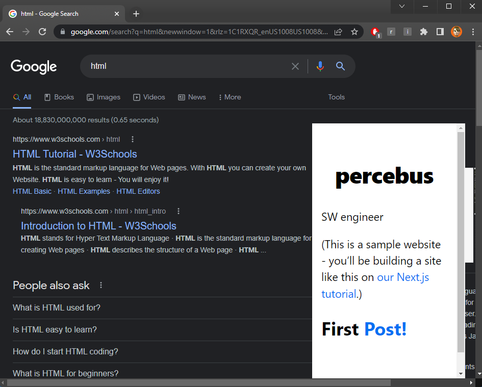
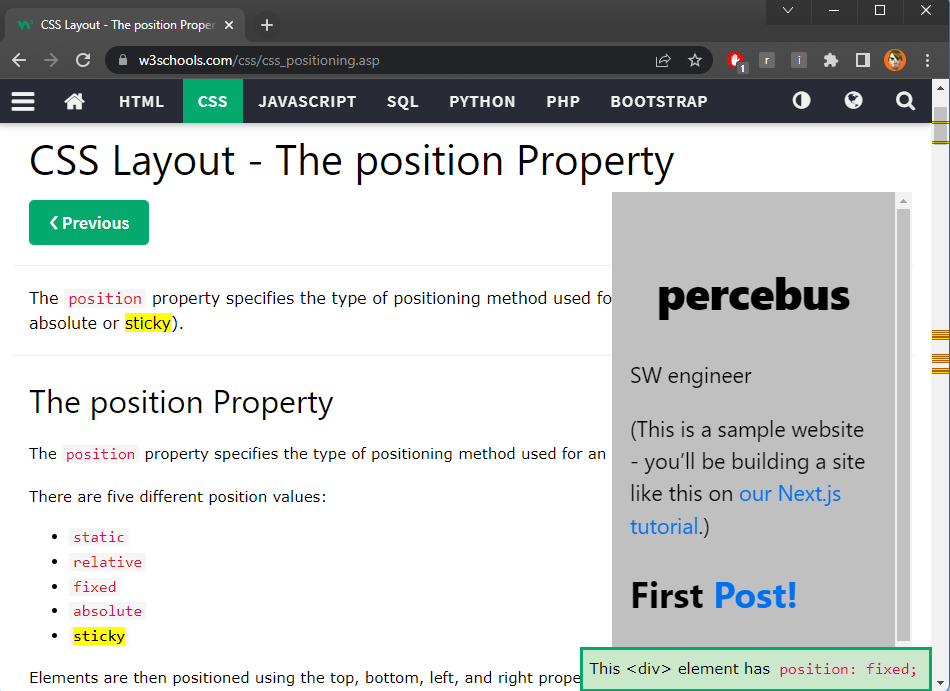

# `iframe-chrome-extension`

It injects an `<iframe />` pointing to a URL

## Pre-requisites

This extension assumes you have an app/website running in `http://localhost:3000` (typically ReactJS)

You can change this `URL` in `content.js`

```javascript
  const URL = 'http://localhost:3000'
```

## Setup

1. `chrome://extensions`
1. Click on [ Load unpacked ]
1. Toggle on enable radio-button

## Run

Simply visit any website

## Examples

### google.com



### w3schools.com


